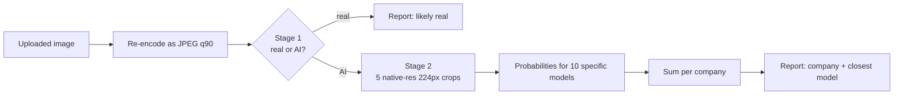

# AI-Generated Image Detector & Source Attribution

Upload an image and get two answers:

1. **Is it AI-generated?** (real vs. AI)
2. **If so, which company's model most likely made it?** Google, OpenAI, ByteDance, or open-source (Stable Diffusion / FLUX), plus the closest specific model.

Built with PyTorch, CLIP and FastAPI. The most useful part of this repo is not the final score but the record of *why* the first versions failed on unseen images and what fixed each failure (see [What I learned](#what-i-learned-from-3-to-64)).

<!-- Add a demo GIF or screenshot here:  -->

---

## Results

All "cross-domain" numbers come from **200 images I generated myself** with the same 50 prompts across ChatGPT, Gemini, Dola and Stable Diffusion XL. None of these images, and none of these prompts, were used for training. Odd-numbered prompts were used to choose between models; even-numbered prompts were only used for the final score below.

### Stage 1: real vs. AI (winner: CLIP ViT-L/14 + logistic regression)

| Test set | n | Accuracy |
|---|---|---|
| Held-out split of the training datasets (real + AI) | 3,189 | 98.1% |
| Self-made images from unseen sources (all AI) | 100 | 99.0% |

The self-made set contains only AI images, so the 99% measures how many AI images are caught. False positives on real photos are only measured by the held-out split.

### Stage 2: which company (winner: ResNet-50 on native-resolution crops)

| Test set | n | Company accuracy |
|---|---|---|
| Held-out split of the training datasets | 911 | 95.7% |
| **Self-made images, unseen prompts (reported score)** | **75** | **64.0%** |

Per company on the self-made set (25 images each, chance level = 25%):

| True source | Correct | Notes |
|---|---|---|
| Google (Gemini) | 21 / 25 | |
| Open-source (SDXL) | 21 / 25 | closest specific model was `sdxl` in 18 of 25 |
| OpenAI (ChatGPT) | 6 / 25 | see limitations |

Model comparison on the selection half (odd prompts):

| Model | Accuracy |
|---|---|
| CLIP + logistic regression | 29.3% |
| CLIP + MLP | 32.0% |
| **ResNet-50, native-resolution crops** | **65.3%** |

CLIP features describe *what* is in the image, which is great for real-vs-AI but weak for telling generators apart. A CNN looking at raw pixels picks up the low-level traces each generator leaves.

---

## How it works



- **Same preprocessing everywhere.** Every image, in training and in the web app, is re-encoded as JPEG quality 90 first, so differences in file format between datasets can't be used as a shortcut.
- **Specific-model labels.** Stage 2 is trained on 10 labels (`nano-banana`, `imagen`, `gpt-4o`, `gpt-image-1`, `dalle-3`, `seedream-3`, `seedream-4.5`, `sdxl`, `flux`, `sd3`). Probabilities are summed per company at prediction time. Loss weights give each company equal total weight.
- **Native-resolution crops.** The ResNet is trained on random 224×224 crops of the full-size image instead of a downscaled copy, with random rescaling and JPEG re-compression as augmentation. At prediction time it averages 5 crops.
- **Three candidates per stage.** CLIP + logistic regression, CLIP + MLP, and a fine-tuned ResNet-50 are trained every run; the winner is picked on the selection half of the self-made set.

---

## What I learned: from 3% to 64%

Stage 2 accuracy on the self-made images, run by run. The early runs used the whole self-made set for both choosing and scoring, so they are not strictly comparable to the final number, but the trend and the causes are the point.

| Change | Cross-domain accuracy | What it showed |
|---|---|---|
| First version | 3.0% | Worse than random guessing: the model was confidently wrong |
| Re-encode every image the same way | 8.0% | Part of the problem was file format, not content (stage 1 also went from 67% to 88%) |
| Add real training data for every class | 40.0% | One class had almost no training data of its own |
| Cap the biggest class to match the others | 34.7% | Throwing data away didn't help; the small classes were the real bottleneck |
| Add ~1,500 GPT-4o images | 44.7% | More data for the weakest class helped it directly |
| Add prompt-matched images from older model versions | 33.3% | Old versions (DALL-E 3, Imagen 3) blurred each company's signal |
| Specific-model labels + native-resolution crops + robustness augmentation | **64.0%** | Biggest jump; SDXL became reliably recognisable |

Two evaluation mistakes I also caught and fixed: choosing the model and reporting the score on the same 150 images, and splitting the self-made set into halves with different content types (the 50 prompts are grouped by type). The final split uses odd/even prompt numbers so both halves cover every content type.

---

## Limitations

- **OpenAI is weak (6/25).** The ChatGPT images I generated look different from every OpenAI source in the training data (GPT-4o, DALL-E 3, a small gpt-image-1 set). The model only recognises generators that are represented in training.
- **ByteDance has no cross-domain test.** I couldn't confirm which model Dola uses, so its 50 images are kept as an unlabelled probe and not scored.
- **Small test set.** 75 test images give a margin of roughly ±11 percentage points on the overall score, and more for each company (25 images each).
- **Not a forensic tool.** Outputs are statistical estimates. They should not be used as evidence about any specific image.

---

## Repository layout

```
├── download_dataset.py            # Kaggle real/AI datasets (stage 1)
├── download_attribution_sets.py   # nano-banana, Seedream 4.5, gpt-image-1 (stage 2)
├── download_gpt4o_images.py       # streams GPT-4o images from OpenGPT-4o-Image
├── download_rapidata_matched.py   # prompt-matched images from several generators
├── gen_sdxl_bulk.py               # generates the SDXL training set
├── gen_sdxl.ipynb                 # generates the 50 SDXL test images
├── preprocess_attribution_set.py  # cleans the self-made test images
├── prepare_manifest.py            # builds train/val/test lists from all sources
├── train_models.py                # trains and compares the 3 models per stage
├── results/                       # summary.json from the final run
└── webapp/
    ├── main.py                    # FastAPI backend
    ├── model_utils.py             # loads the winning models, runs inference
    ├── requirements.txt
    └── static/index.html          # single-page frontend
```

Datasets and model weights are not stored in this repo (see below).

---

## Quick start: run the web app

1. Download the trained weights (`model_out.zip`) from the [Releases](../../releases) page and unzip it next to `webapp/`.
2. Install and run:

```bash
cd webapp
python -m venv .venv
source .venv/bin/activate          # Windows: .venv\Scripts\activate
pip install -r requirements.txt

export MODEL_DIR=../model_out
export HF_ENDPOINT=https://huggingface.co   # code defaults to a mirror for mainland China
uvicorn main:app --port 8000
```

3. Open http://localhost:8000. The first upload downloads CLIP ViT-L/14 (~1.7 GB), so it is slow once. Runs on CPU and uses a few GB of RAM.

API: `POST /predict` with a multipart `file` field returns JSON with `p_ai`, `is_ai` and an `attribution` block.

---

## Reproduce the training

```bash
pip install -r webapp/requirements.txt datasets kagglehub pyarrow diffusers accelerate

python download_dataset.py             # needs a Kaggle API token
python download_attribution_sets.py
python download_gpt4o_images.py
python download_rapidata_matched.py
python gen_sdxl_bulk.py                # needs a GPU
python preprocess_attribution_set.py   # needs your own 4 x 50 test images in data/
python prepare_manifest.py
python train_models.py                 # PHASES=phase2 to retrain stage 2 only
```

The full run took about 40 minutes on a single rented GPU. Each script's docstring lists its options.

---

## Data sources

| Used for | Dataset | License |
|---|---|---|
| Stage 1 | [Human vs AI-Generated Image Classification](https://www.kaggle.com/datasets/laxmikantaroy/human-vs-ai-generated-image-classification-dataset) | see dataset page |
| Stage 1 | [AI Media Classifier](https://www.kaggle.com/datasets/kotayogi/ai-media-classifier) | see dataset page |
| Stage 2, Google | [bitmind/nano-banana](https://huggingface.co/datasets/bitmind/nano-banana) | MIT |
| Stage 2, ByteDance | [ash12321/seedream-4.5-generated-2k](https://huggingface.co/datasets/ash12321/seedream-4.5-generated-2k) | MIT |
| Stage 2, OpenAI | [WINDop/OpenGPT-4o-Image](https://huggingface.co/datasets/WINDop/OpenGPT-4o-Image) (text-to-image part only) | Apache-2.0 |
| Stage 2, OpenAI | [gpt-image-1 pictures](https://www.kaggle.com/datasets/seifbenayed/gpt-image-1-pictures) | see dataset page |
| Stage 2, all | [Rapidata/Seedream-3_t2i_human_preference](https://huggingface.co/datasets/Rapidata/Seedream-3_t2i_human_preference) (images only; voter data not used) | see dataset page |
| Stage 2, open-source | Generated locally with [SDXL base 1.0](https://huggingface.co/stabilityai/stable-diffusion-xl-base-1.0) | model license |

`real-and-ai-generated-image-detect` (CIFAKE, 32×32 px) was downloaded but excluded: its resolution is too far from the other data and would become a shortcut.
